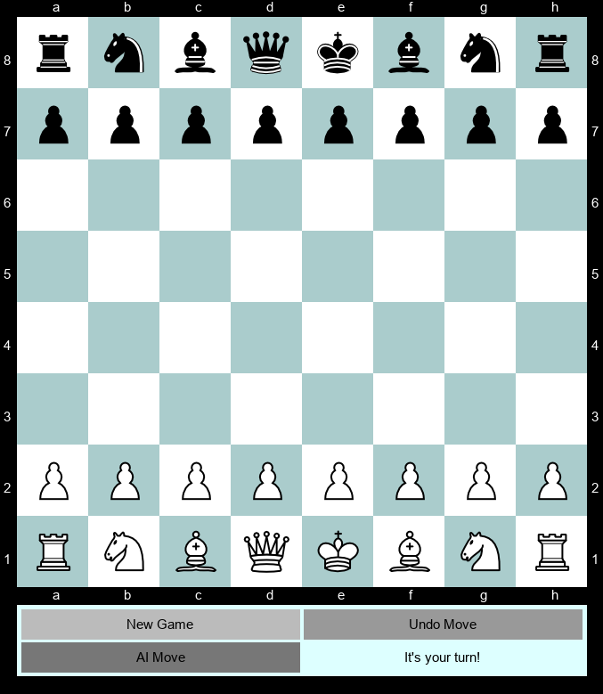
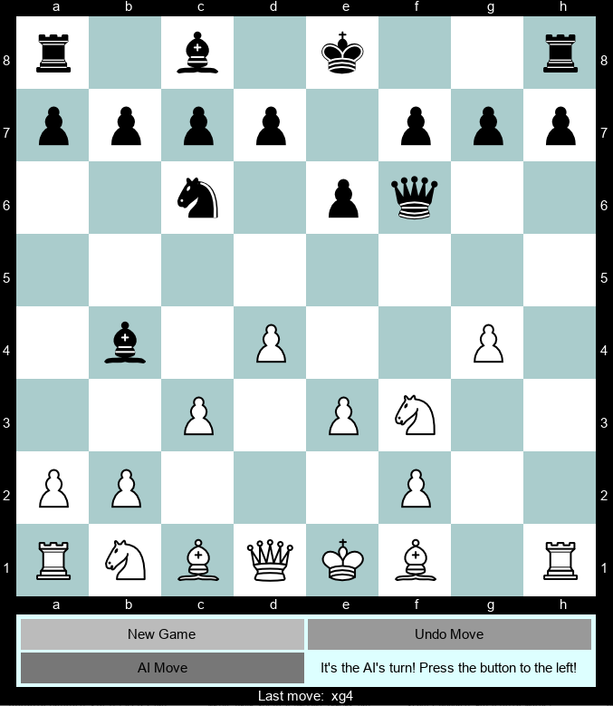
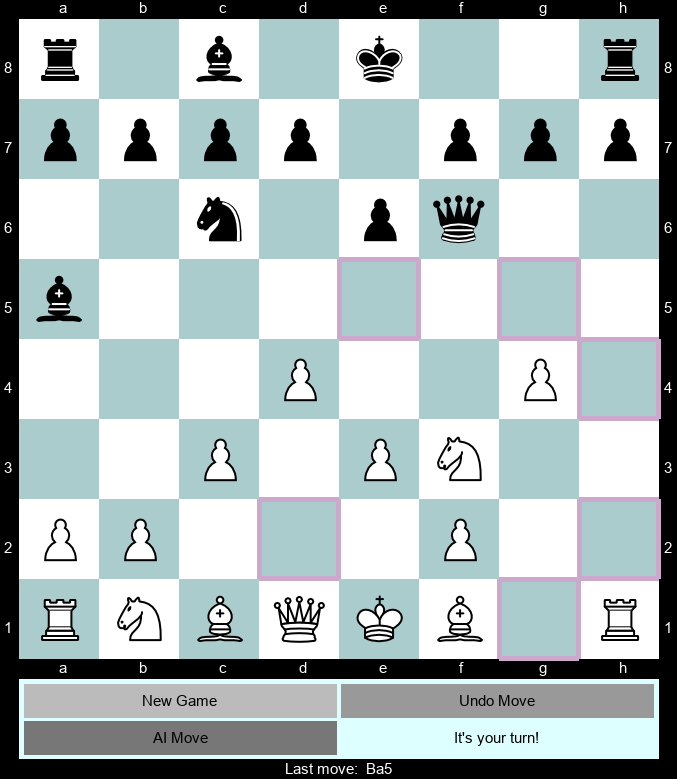

# Utahchess Chess Engine

- [Utahchess Chess Engine](#utahchess-chess-engine)
  - [Installation Guide](#installation-guide)
    - [Basic](#basic)
    - [For Dev](#for-dev)
    - [For GUI](#for-gui)
  - [How to use](#how-to-use)
    - [Board](#board)
    - [Getting legal moves and making them](#getting-legal-moves-and-making-them)
    - [Game of chess](#game-of-chess)
    - [GUI](#gui)
    - [Minimax](#minimax)
  - [Miscellaneous](#miscellaneous)
    - [Minimax analysis](#minimax-analysis)
    - [Some GUI screenshots](#some-gui-screenshots)
    - [Dev utils](#dev-utils)

This package is a chess engine entirely written in Python. A small proof of concept of a GUI using `pygame` where you can play against the CPU can be found in the `gui` folder.

## Installation Guide

Python 3.8 or more is required to install the package. Three rules are defined to install the package:

### Basic
- Without any development or GUI dependencies
- Run `pip install .` from project root
### For Dev
- With all dependencies used for development (i.e. `mypy`, `flake8`, `black`, `isort` and `pytest`)
- Run `pip install .[dev]` from project root
### For GUI
- With `pygame` to run the pygame GUI
- Run `pip install .[GUI]` from project root

Add the `-e` flag for an editable install in all cases. 

Run `bash bin/create_environment.sh` to create a virtual environment for the installation, if desired.
There are also three other shell scripts in the `bin` folder (`install_<placeholder>_dependencies.sh`) which can be used with the `source` command to help install the package into the virtual environment. Installation is editable by default if using the shell scripts.

## How to use
### Board
- The `Board` class in `utahchess.board` is used as a container for the chess pieces. 
- It can be directly manipulated with the `move_piece` and `delete_piece` methods.
- Boards can be instantiated using a sequence of `Piece` objects or a string that looks as follows:

```python
    f'''oo-oo-oo-oo-oo-oo-oo-oo
        oo-oo-oo-oo-bk-oo-oo-oo
        oo-oo-oo-oo-oo-oo-oo-oo
        wp-bp-wp-oo-oo-oo-oo-oo
        oo-oo-oo-oo-oo-oo-oo-oo
        oo-oo-oo-oo-oo-oo-oo-oo
        oo-oo-oo-oo-oo-oo-oo-oo
        oo-oo-oo-oo-wk-oo-oo-oo'''
```
- The method `to_string()` can be used to create a string such as the above.

### Getting legal moves and making them
- The function `get_move_per_algebraic_identifier` in `utahchess.legal_moves` can be used to compute all legal moves on a given `Board`. 
- Note that an optional argument `last_move` can be provided. This is necessary to compute en passant moves correctly but can be left out, too.
- It returns a mapping of strings describing all legal moves in algebraic notation to instances of the `Move` class which can be used with ...
- ... the `make_move` function in `utahchess.Move` to execute a move on a given board.
### Game of chess
- The `ChessGame` class in `utahchess.chess` can be used to play a complete game of chess.
- The main loop in `utahchess.chess` shows how to play a game of chess in the command line using user input for both sides of the game.
- To implement a game of chess yourself the utils `utahchess.move_validation.is_check`, `utahchess.legal_moves.is_checkmate` and `utahchess.legal_moves.is_stalemate` can be used to check the status of a board.
### GUI
- The proof of concept GUI using pygame can be tried out by executing `python gui/pygame/pygame.gui`.
- The GUI allows the user to play against the CPU, powered by an alpha-beta pruned minimax algorithm.
### Minimax
- An implementation of the minimax algorithm with alpha-beta pruning can be found in `utahchess.minimax`, called `minimax`. 
- A small helper class called `Node` can be used to provide the nodes necessary to navigate through the game tree.
- The minimax function is general purpose and be used for other games by providing appropriate `get_children` and `value function` parameters.
- Implementations of those two parameters which can be used with the chess engine can be found in the module itself: `get_node_value` and `create_children_from_parent`.
  
## Miscellaneous
### Minimax analysis
An analysis was conducted to showcase the power of alpha-beta pruning and ordering nodes in the game tree by potential volume.

The minimax algorithm was used to compute the optimal move for depths 1 through 5 for a variety of semi-random chess board configurations. For each depth the minimax algorithm was used with and without alpha-beta pruning as well as with alpha-beta pruning and nodes ordered by their potential value via a simple ad-hoc rule.

As expected the performance gain of alpha-beta pruning and the moves ordering can be seen especially at higher depths. The following table contains the number of seconds each experiment took to run:

| Depth | Number of boards | Baseline [s] | Only pruned [s] | Pruned and ordered [s] |
| ----- | ---------------- | ------------ | --------------- | ---------------------- |
| 1     | 100              | 1.96         | 1.91            | 1.87                   |
| 2     | 50               | 36           | 22              | 25                     |
| 3     | 10               | 199          | 35              | 11                     |
| 4     | 10               | 8237         | 210             | 154                    |
| 5     | 10               | N/A          | 2874            | 313                    |

Same table but with number of seconds per board:

| Depth | Number of boards | Baseline [s/board] | Only pruned [s/board] | Pruned and ordered [s/board] |
| ----- | ---------------- | ------------------ | --------------------- | ---------------------------- |
| 1     | 100              | 0.0196             | 0.0191                | 0.0187                       |
| 2     | 50               | 0.72               | 0.44                  | 0.5                          |
| 3     | 10               | 19.9               | 3.5                   | 1.1                          |
| 4     | 10               | 823.7              | 21                    | 15.4                         |
| 5     | 10               | N/A                | 287.4                 | 31.3                         |

### Some GUI screenshots





### Dev utils
- The two shell scripts `bin/format.sh` and `bin/lint.sh` can be used to format- and lint the code respectively.

